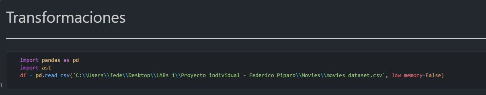

---

# 🚀 Proyecto-Individual-Piparo-Federico

####  ¡Bienvenido al repositorio del proyecto individual de Federico Piparo! 🎉 Aquí encontrarás toda la información necesaria para entender y explorar el proyecto.

---

#### 📚 Descripción del Proyecto
al tratarse este proyecto de una evaluación más allá de un proyecto real, explicaré las decisiones y problemas que me hayan surgido a lo largo de este, aparte de aclaraciones sobre el funcionamiento de este, dividiendolo en las diferentes "partes" del mismo.

En muy pocas palabras el proyecto consiste en

#### Aclaraciones generales 

Aclarar tambien que la carpeta Movies contiene las tablas originales, sin transformaciones, en caso de no no ejecutar el archivo `Transformaciones.ipynb` este no tendría ninguna utilidad. En caso de querer ejecutarlo, deberás cambiar la ruta que se ve a continuación a la ruta en la que se encuentre la carpeta "Movies"

 El archivo `.gitattributes`  en general se utiliza para configurar cómo Git maneja ciertos archivos en tu repositorio. En este caso `.csv filter=lfs diff=lfs merge=lfs -text` indica que todos los archivos .csv deben ser gestionados por Git LFS y se excluyen de las diferencias y fusiones normales de texto.

---

# Transformaciones

🛠️ Desafíos y Soluciones

Aun que sea algo obvio, en caso de querer 
Formato CSV: el formato CSV no admite tipos de datos "compuestos" como lo son diccionarios o columnas, por lo cual fue necesario implementar una función que analice la estructura de los datos, y en caso de cumplir con la de una lista o un diccionario los transforme en uno de estos. 

🧩 Desafío 1: [Nombre del Desafío]
Descripción:
Aquí puedes describir el primer desafío. ¿Qué lo hizo complicado? ¿Por qué fue un obstáculo?

Solución:
Explica cómo resolviste este desafío. ¿Qué herramientas o técnicas utilizaste?

🧩 Desafío 2: [Nombre del Desafío]
Descripción:
Aquí puedes describir el segundo desafío. ¿Qué lo hizo complicado? ¿Por qué fue un obstáculo?

Solución:
Explica cómo resolviste este desafío. ¿Qué herramientas o técnicas utilizaste?

📝 Instrucciones para Ejecutar el Proyecto
Aquí van las instrucciones para que otros puedan ejecutar el proyecto en sus propias máquinas. Incluye pasos específicos y comandos necesarios:

