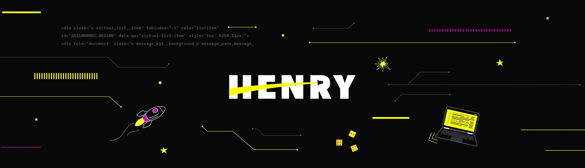

# 🚀 Proyecto-Individual-Piparo-Federico
¡Bienvenido al repositorio del proyecto individual de Federico Piparo! 🎉 Aquí encontrarás toda la información necesaria para entender y explorar el proyecto.

📚 Descripción del Proyecto
Aquí va una breve descripción del proyecto. Explica de manera general qué es el proyecto, cuál es su propósito y qué se espera lograr con él. Por ejemplo:

Este proyecto se centra en [describir el objetivo principal del proyecto]. Se ha diseñado para [explicar qué problemas resuelve o qué beneficios ofrece].

🛠️ Desafíos y Soluciones
En esta sección, detalla los principales desafíos que encontraste y cómo los resolviste. Utiliza emojis para hacer la lectura más amena:

🧩 Desafío 1: [Nombre del Desafío]
Descripción:
Aquí puedes describir el primer desafío. ¿Qué lo hizo complicado? ¿Por qué fue un obstáculo?

Solución:
Explica cómo resolviste este desafío. ¿Qué herramientas o técnicas utilizaste?

🧩 Desafío 2: [Nombre del Desafío]
Descripción:
Aquí puedes describir el segundo desafío. ¿Qué lo hizo complicado? ¿Por qué fue un obstáculo?

Solución:
Explica cómo resolviste este desafío. ¿Qué herramientas o técnicas utilizaste?

📝 Instrucciones para Ejecutar el Proyecto
Aquí van las instrucciones para que otros puedan ejecutar el proyecto en sus propias máquinas. Incluye pasos específicos y comandos necesarios:

